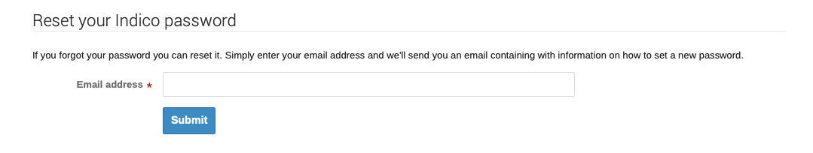
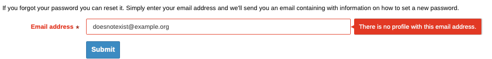
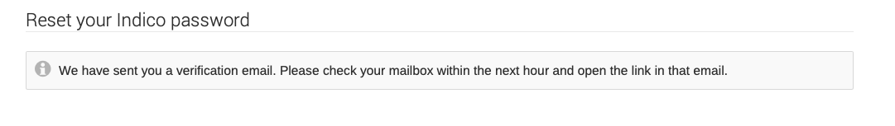
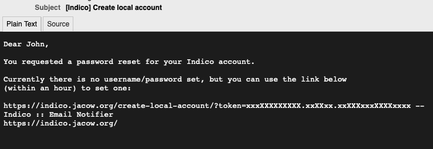
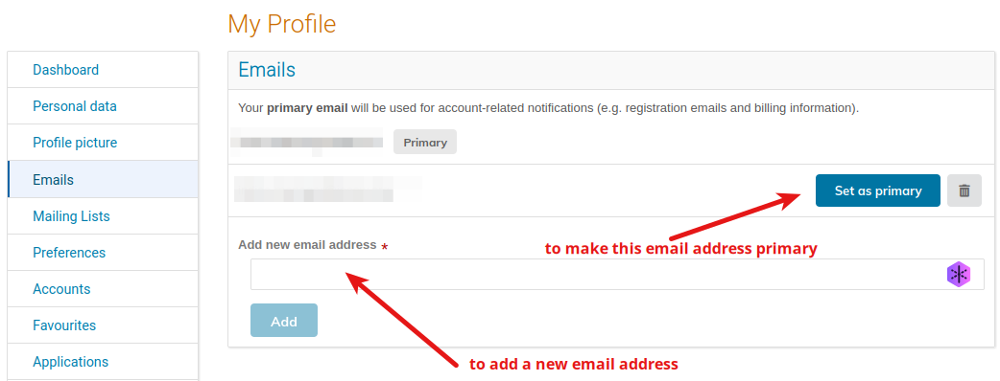

# Common account issues and solutions

## 1. Forgotten password

In case you forgot the password for your JACoW Indico account, or it just doesn't work, it is possible to reset it with a new one. Follow these instructions:

1. Open the link  [https://indico.jacow.org/reset-password/](https://indico.jacow.org/reset-password/).

2. Enter the email address linked to your Central Repository account. 
   
     - If you are not sure of the correct email address, you can try different addresses here. If it is the wrong address, you will get this error: 
     - If you get this error, please **go back to point 1**.

3. Once you are successful, you should see the following screen: 

4. You should shortly receive an email containing the reset link like such: 
   
     - Check your SPAM folder if you cannot find this in your inbox.

5. Follow the provided link and enter your desired *email address*, *password* and confirm your *password*.

6. You should now be logged in! You can use your *email address* and *password* for future logins. 

## 2. Change of email address

It could happen that the email address used for your JACoW Indico account has been deactivated or removed (e.g., due to a job switch).

No worries, in this case you won't be able to receive notifications but you can still use that email address to login to Indico. Then, you can the new email address in your Indico profile:

Please note that every new email added needs to be verified: you will receive a confirmation email with a link you need to open. Please note that **this link must be opened by the same browser where you are already logged in in Indico**.

## 3. Lost password and email not working

In this case only the JACoW Central Repository Managers can modify your email address. Please send a request to `repository-manager@jacow.org`. Please note that you will need to prove your identity and confirm the new email address.

## 4. Multiple accounts to be merged

If you find that you have more than one JACoW Indico account in your name and you wish to merge them, please contact `indico-support@jacow.org` listing the e-mail addresses of the accounts you wish to merge. You will need to prove that you have ownership of both accounts.
