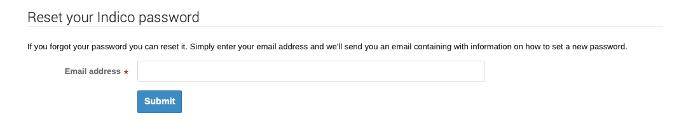
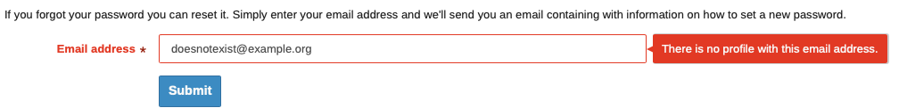
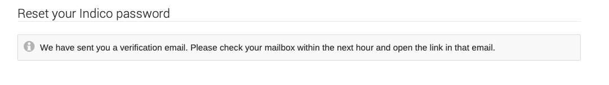
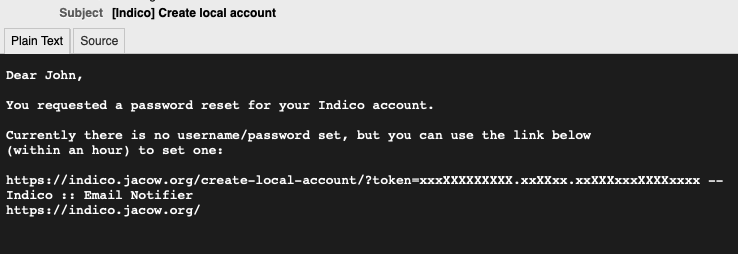
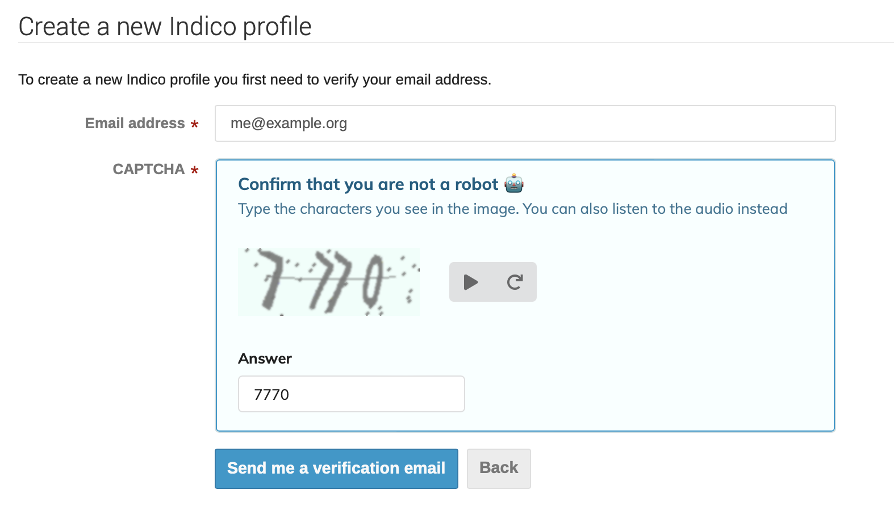
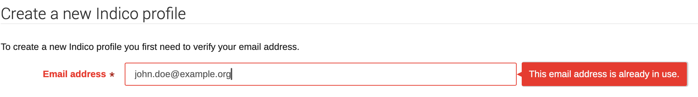
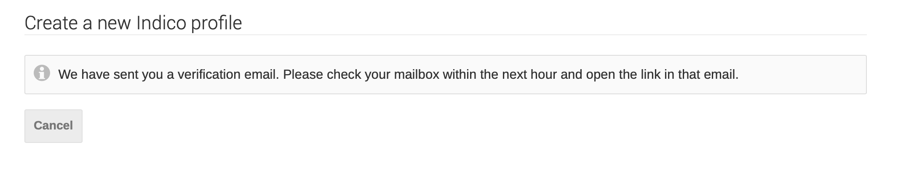
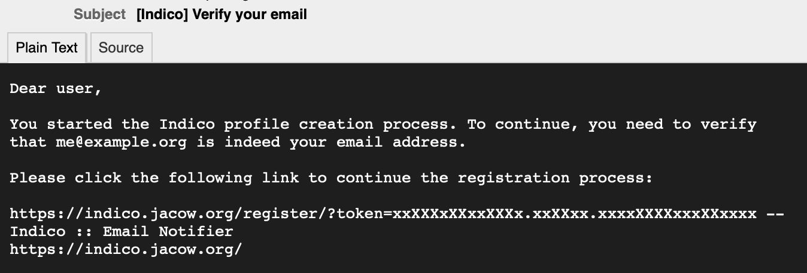
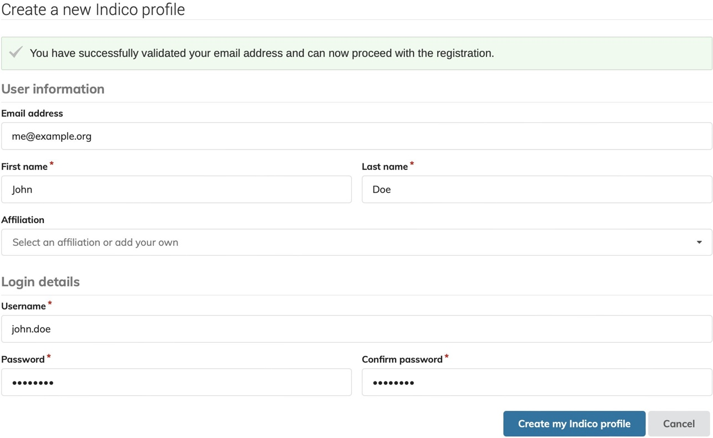

# Logging onto Indico after the 17th of March 2025

*JACoW* changed its authentication method. While previously the *JACoW Central Repository*/*SPMS* was used, now *JACoW Indico* itself is going to be the source for user profiles. All existing *JACoW Indico* accounts have been preserved, but the authentication method has changed and **your log-in details need to be reset**.

There are two possible scenarios:

- *Scenario A*: **You have a JACoW Central Repository account** and **have previously logged into the JACoW Indico** (indico.jacow.org) - You will need to perform a password reset using the same email address you have used to register to the Central Repository. Steps are detailed below.

- *Scenario B*: **You have never logged into JACoW Indico**, and **may or may not have a Central Repository account** - You will need to create a new account to access JACoW Indico. Please keep reading the guide.

Please carefully read the guide below and follow the steps according to your situation.

## Step 1. Determining if you have a JACoW Indico account

If you are unsure if you have logged into Indico, or have forgotten which email address you were using for authentication, we first recommend to check your Inbox for emails sent by `noreply-indico-team@cern.ch`, or other addresses `@jacow.org`. If you find such an email, check the "To" address, and that should be the one associated to your account.

If you can remember which address you used or have a short list of addresses that could be linked to your JACoW Indico Account, **proceed to [Step 2 - Scenario A](#scenario-a-i-have-a-jacow-central-repository-account-and-have-previously-logged-into-jacow-indico)**.

## Step 2. Resetting your account

If you are still in doubt which scenario applies to you, **proceed with Scenario A**.

### Scenario A: I have a JACoW Central Repository account and have previously logged into JACoW Indico

1. Open the https://indico.jacow.org/reset-password/.
2. Enter the email address linked to your Central Repository account. 
     - If you are not sure of the correct email address, you can try different addresses here. If it is the wrong address, you will get this error: 
     - If you get this error, please **go back to point 1**. If you have exhausted your list of possible addresses, jump to **[Scenario B](#scenario-b-i-have-never-logged-into-jacow-indico-and-may-or-may-not-have-a-central-repository-account)**.
3. Once you are successful, you should see the following screen: 
4. You should shortly receive an email containing the reset link like such: 
     - Check your SPAM folder if you cannot find this in your inbox.
5. Follow the provided link and enter your desired *email address*, *password* and confirm your **password*.
6. You should now be logged in! You can use your *email address* and *password* for future logins. Moreover, if you forget your password, you can reset it in the future following the same procedure.

### Scenario B: I have never logged into JACoW Indico and may or may not have a Central Repository account

**Please make sure you do not already have an Indico account before proceeding with these steps**. You are encouraged to go back to *[Scenario A](#scenario-a-i-have-a-jacow-central-repository-account-and-have-previously-logged-into-jacow-indico)* and attempt an account reset before you follow through this part of the guide.

1. Open the [account creation form](https://indico.jacow.org/register/).
2. Enter your email address and fill in the CAPTCHA. 
3. If you get the following error, **go back to [Scenario A](#scenario-a-i-have-a-jacow-central-repository-account-and-have-previously-logged-into-jacow-indico)**. 
4. You should see the following message. 
5. You should shortly receive a confirmation email containing the verification link like such: 
     - Check your SPAM folder if you cannot find this in your inbox.
6. Follow the link and fill in your profile data.
   
7. You should now be logged into your new JACoW Indico profile! You can use your *email address* and *password* for future logins. Moreover, if you forget your password, you can reset it in the future following the procedure in *[Scenario A](#scenario-a-i-have-a-jacow-central-repository-account-and-have-previously-logged-into-jacow-indico)*.

## Dealing with duplicate accounts

If you find that you have more than one JACoW Indico account in your name and you wish to merge them, please contact indico-support@jacow.org listing the e-mail addresses of the accounts you wish to merge.
