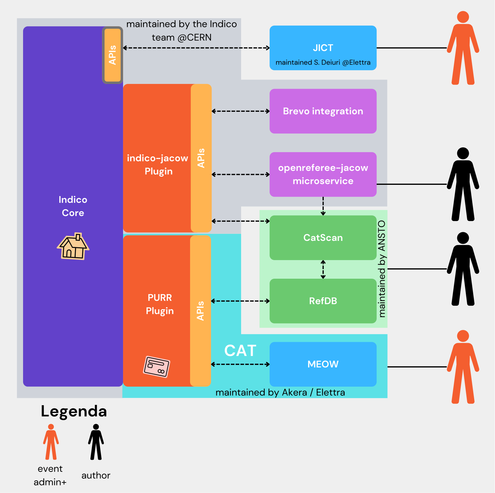

# 

This site hosts the documentation on **how to run a [JACoW](https://www.JACoW.org) conference 
with [Indico](https://getindico.io)** and related tools needed before, during and after the event takes place

## Basic how-to for conference attendees

The [General](General/login/) section of this site contains basic instructions for common user actions, like *how to login* or *manage your JACoW account*. 

## How-to organise a JACoW Conference (manual)

[{ align=left }](https://ipac-docs.jacow.org) Every JACoW conference is made equal, but some are more equal than others. 
The [manual](https://ipac-docs.jacow.org) made for IPAC covers all the aspects needed to organise a JACoW conference, even for smaller ones (which can simplify some workflows or settings). It is available at the address [ipac-docs.jacow.org](https://ipac-docs.jacow.org).

## IT documentation

But it's not only Indico... a lot of other tools are needed. 
Information, instructions and how-to's are available at [http://it-docs.jacow.org/](http://it-docs.jacow.org/) (dedicated to conference organisers, especially IT managers).

## JACoW tools documentation

Most of the following tools are needed, but not all of them need an organiser's touch. The [manual](https://ipac-docs.jacow.org) above links to them when this is needed. 

### Tools overview

The following diagram describes the main relationships among the most common tools used to manage a JACoW conference. Refer to the detailed table below for a description of each tool.

| Tool                                                                                                                                                                                                                                                                                                   | Documentation site                                                                    |
| ------------------------------------------------------------------------------------------------------------------------------------------------------------------------------------------------------------------------------------------------------------------------------------------------------ | ------------------------------------------------------------------------------------- |
| [Indico](https://github.com/indico/) JACoW conferences/events are managed by Indico - independently hosted at CERN for JACoW ([indico.jacow.org](https://indico.jacow.org))                                                                                                                        | [getindico.io](https://getindico.io)                                                  |
| [JACoW Indico plugin](https://github.com/indico/indico-plugin-jacow) This plugin implements some specific JACoW characteristics that are not available in the generic Indico                                                                                                                       |                                                                                       |
| [OpenReferee webservice](https://github.com/indico/openreferee-jacow) This web application implements the specific JACoW editing workflow (like the multiple editable states and the QA phase)                                                                                                     |                                                                                       |
| [Conference Assembly Tool (CAT)](https://github.com/JACoW-org/CAT) CAT can create JACoW-compliant proceedings from the material stored in and managed by Indico                                                                                                                                    | [CAT-docs.jacow.org](https://CAT-docs.jacow.org)                                      |
| [Proceedings Utility Running Remotely (PURR)](https://github.com/JACoW-org/PURR) PURR is the CAT frontend interface in Indico. Being an Indico plugin, it is hosted on the same server where Indico runs ([indico.jacow.org](https://indico.jacow.org))                                            | [PURR-docs.jacow.org](https://PURR-docs.jacow.org)                                    |
| [Machine Editor for cOnferences Website (MEOW)](https://github.com/JACoW-org/MEOW) MEOW is the worker that actually creates the proceedings. It can have multiple instances. The main and default one is hosted at Elettra                                                                         | [MEOW-docs.jacow.org](https://MEOW-docs.jacow.org)                                    |
| [JACoW-Indico Conference Tools (JICT)](https://github.com/JACoW-org/JICT) Multiple utilities needed before, during and after the conference by the Editor in Chief. It contains tools like submission statistics, editable checks, Proceedings Office screens, Dotting Board, Poster Manager tools |                                                                                       |
| [Acrobat/PitStop/PowerPoint tools for paper editing](https://github.com/JACoW-org/AcrobatPitStopTools) Endpoint tools - needed on the Proceedings Office workstations used by editors                                                                                                              |                                                                                       |
| [IPAC Light Peer Review advanced management with Indico](https://github.com/JACoW-org/IPAC-LPR) Utilities to enhance Indico's peer review the IPAC way                                                                                                                                             |                                                                                       |
| [CatScan interface](https://github.com/JACoW-org/catscan-interface) Frontend for CatScan - used by authors and editors to check compliance of submitted source files. Hosted on GitHub by way of GitHub Pages                                                                                      | [jacow.org/Authors/CSEHelp](https://www.jacow.org/Authors/CSEHelp)                    |
| [CatScan checker](https://github.com/JACoW-org/catscan-checker)  Worker for CatScan - this is the engine that actually performs the checks, triggered by the CatScan interface                                                                                                                     |                                                                                       |
| [References DB](https://github.com/JACoW-org/refdb) Database of reference to JACoW papers. Can also provide references to non-JACoW papers in the correct format                                                                                                                                   | [jacow.org/Authors/RefSearchToolHelp](http://www.jacow.org/Authors/RefSearchToolHelp) |
| [JACoW templates](https://github.com/JACoW-org/JACoW_Templates) Collections of source files (and instructions) to write JACoW papers in the correct format                                                                                                                                         | [jacow.org/Authors/HomePage](https://www.jacow.org/Authors/HomePage)                  |
| [Software deploy and setup for regular JACoW Editor Workstation using Puppet's Bolt](https://github.com/JACoW-org/Editor-WS_SW-setup) Utility to easily deploy software onto the Editor workstations in the Proceedings Office                                                                     |                                                                                       |
| [Small but efficient Speaker Timer written in JavaScript](https://github.com/JACoW-org/JsTimer) Can be used on stage in the auditoria during the conference if not provided by the venue                                                                                                           |                                                                                       |
